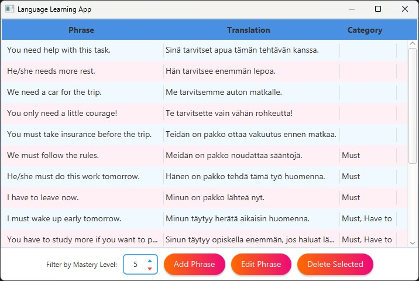

# Language Learning App

A desktop JavaFX application designed to help language learners manage, categorize, and track phrases by mastery level. Users can add new phrases, assign translations and categories, and filter the phrase list based on their learning progress.

## Features

- Add and delete phrases
- Assign categories and mastery levels to each phrase
- Filter phrases by mastery level using an interactive spinner
- Modular architecture with MVVM pattern
- Data storage using SQLite

## Upcoming Features

More features will be added in future versions, including:

- Search functionality: Enable searching for phrases based on keywords or categories.
- Export/Import functionality: Allow users to export their phrases to a file or import them from external sources.
- Language tests

